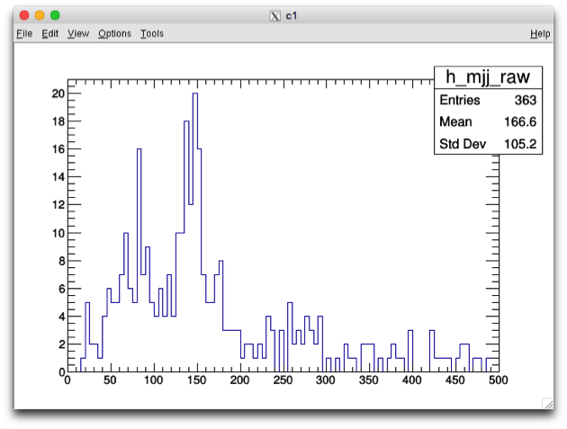

## Running the tutorial example at BNL Tier3


<details>
<summary>Table of Contents</summary>
Table of Contents
=================

      * [Running the tutorial example at BNL Tier3](#running-the-tutorial-example-at-bnl-tier3)
         * [Login to BNL machines](#login-to-bnl-machines)
         * [Location of this analysis example package at BNL](#location-of-this-analysis-example-package-at-bnl)
         * [Setup of the Release Env](#setup-of-the-release-env)
         * [Package Building](#package-building)
         * [Dataset Preparation](#dataset-preparation)
         * [Usage of script pnfs_ls.py](#usage-of-script-pnfs_lspy)
         * [Interactive Job Running at BNL](#interactive-job-running-at-bnl)
         * [Condor Batch Job Running at BNL](#condor-batch-job-running-at-bnl)
</details>


### Login to BNL machines
First you need ssh to spar machines at BNL:
```shell
$ ssh -Y atlasgw
$ rterm -i
```

### Location of this analysis example package at BNL
You can pull the analysis package under the same github repo directory or copy from the directory at BNL:

```
/atlasgpfs01/usatlas/data/yesw2000/T3-Example-BNL/
|-- 00-Readme.txt
|-- Condor-Job
|   `-- test-condor.job
`-- src
    |-- CMakeLists.txt
    `-- Exam_JetsPlot.cxx
```

where you can find:
- the text instruction file **00-Readme.txt**, from which you can copy/paste the commands used in this tutorial.
- The condor job description file **test-condor.job**
- And the source code of this analysis pacakge under subdir **src/**


### Setup of the Release Env
First set up the release env by:
```
setupATLAS
asetup AnalysisBase,21.2.81
```
Next time you log in, you can simply run **asetup** under the same dir.


### Package Building
To build the single package, just run under that dir:
```shell
cmake src  # generate Makefile
make       # compile & create executable file
```

After the package is built, you will see
> $ ls -F
00-Readme.txt   Makefile
CMakeCache.txt  bin/
CMakeFiles/     cmake_install.cmake
Condor-Job/     src/

and

> $ ls  bin/  
Exam_JetsPlot

To get the usage of the single analysis program, run
```
bin/Exam_JetsPlot -h
```
You will get
<blockquote><pre>Usage: bin/Exam_JetsPlot <option(s)> inputRootFile

        A simple example to make a few jet plots

Options:
        -h,--help               Show this help message
</pre></blockquote>


### Dataset Preparation

To run the analysis, we need an input dataset.
dset=*data18_13TeV.00348885.physics_Main.deriv.DAOD_EXOT12.f937_m1972_p3553_tid14278917_00*
To list the files in the dataset, set up rucio env and VO-atlas proxy first, 
     then run script pnfs_ls.py to list file path.
```shell
lsetup rucio
voms-proxy-init -voms atlas
pnfs_ls.py $dset -o dset-inside.clist                       # pls run "pns_ls.py -h" for usage (next section)
pnfs_ls.py $dset --useXRootdOutside -o dset-outside.clist   # for outside access
```

Let us look into the generated file dset-inside.clist
`$ head -5 dset-inside.clist`
<blockquote><pre>
# clist file for access within BNL
#site= BNL-OSG2_LOCALGROUPDISK ; dset= data18_13TeV.00348885.physics_Main.deriv.DAOD_EXOT12.f937_m1972_p3553_tid14278917_00
root://dcgftp.usatlas.bnl.gov:1096//pnfs/usatlas.bnl.gov/LOCALGROUPDISK/rucio/data18_13TeV/da/ea/DAOD_EXOT12.14278917._000001.pool.root.1
root://dcgftp.usatlas.bnl.gov:1096//pnfs/usatlas.bnl.gov/LOCALGROUPDISK/rucio/data18_13TeV/32/82/DAOD_EXOT12.14278917._000002.pool.root.1
root://dcgftp.usatlas.bnl.gov:1096//pnfs/usatlas.bnl.gov/LOCALGROUPDISK/rucio/data18_13TeV/86/76/DAOD_EXOT12.14278917._000003.pool.root.1
</pre></blockquote>


### Usage of script pnfs_ls.py

To get the script pnfs_ls.py usage, just run **pnfs_ls.py -h**:
<blockquote><pre>% pnfs_ls.py -h
Usage: 
     pnfs_ls.py [options] dsetListFile
  or
     pnfs_ls.py [options] dsetNamePattern[,dsetNamePattern2[,more namePatterns]]
  or
     pnfs_ls.py -o clistFilename /pnfs/FilePathPattern [morePaths]
  or
     pnfs_ls.py -p -o clistFilename [pnfsFilePath | pnfsDirPath] [morePaths]

  This script generates pfn (physical file name), pnfs-path,  
or xrootd-path of files on BNL dcache for given datasets or files on PNFS,
where wildcard and symlink are supported in pnfsFilePath and pnfsDirPath

Options:
  -h, --help            show this help message and exit
  -v                    Verbose
  -V, --version         print my version
  -p, --privateFiles    List private non-dataset files on dCache
  -i, --incomplete      Use incomplete sites if complete not available
  -u, --usersDCache     Use datasets under users private dCache
  -l, --listOnly        list only matched datasets under users dCache, no pfn output
  -o OUTPFNFILE, --outPfnFile=OUTPFNFILE
                        write pfn list into a file instead of printing to the screen
  -d OUTPFNDIR, --dirForPfn=OUTPFNDIR
                        write pfn list into a directory with a file per dataset
  -N, --usePNFS         using pNFS access, default is xrootd within BNL
  --useXRootdOutside    using xroot from outside BNL: access, default is
                        xrootd within BNL
  -L LOCALBNLSITE, --localBNLSite=LOCALBNLSITE
                        specify a BNL site, overriding the one choosen by the script
</pre></blockquote>


### Interactive Job Running at BNL

Now we can run the job interactively
```shell
mkdir Interactive-Job
cd Interactive-Job
```

Take one input file in "dset-inside.clist"

```shell
inputFile=root://dcgftp.usatlas.bnl.gov:1096/pnfs/usatlas.bnl.gov/LOCALGROUPDISK/rucio/data18_13TeV/da/ea/DAOD_EXOT12.14278917._000001.pool.root.1
../bin/Exam_JetsPlot $inputFile > myjob.log 2>&1
```

It will write out an output file myOutputFile.root
You can take a look of the log file myjob.log, containing info of 
input file and event processing progress.

Let us look into the output root file **myOutputFile.root**
<blockquote>
% root -l  myOutputFile.root
root [1] .ls
TFile**         myOutputFile.root
 TFile*         myOutputFile.root
  KEY: TH1D     h_njets_raw;1
  KEY: TH1D     h_mjj_raw;1
root [2] h_mjj_raw->Draw();
</blockquote>
which will yield the plot 




### Condor Batch Job Running at BNL

At BNL, the batch queue uses condor system.
The working directory of Condor batch jobs is different from current 
working directory, and you need specify "GetEnv = True" to pass 
the current env variables.
```shell
cd Condor-Job
ls -l $X509_USER_PROXY    # under local disk /tmp/, we need copy/delegate it to the batch machines
```

Let us take a look of job description file **test-condor.job**
> $ cat test-condor.job
```
universe=vanilla

output=myjob.out
error=myjob.err
log=myjob-running.log

executable=../bin/Exam_JetsPlot
inputFile = root://dcgftp.usatlas.bnl.gov:1096/pnfs/usatlas.bnl.gov/LOCALGROUPDISK/rucio/data18_13TeV/03/7e/DAOD_EXOT12.14278917._000011.pool.root.1
arguments=$(inputFile)

GetEnv    = True                         # pass the env
x509userproxy = $ENV(X509_USER_PROXY)    # copy the grid proxy

# this is what turns this feature on
should_transfer_files=yes
WhenToTransferOutput=on_exit

queue
```